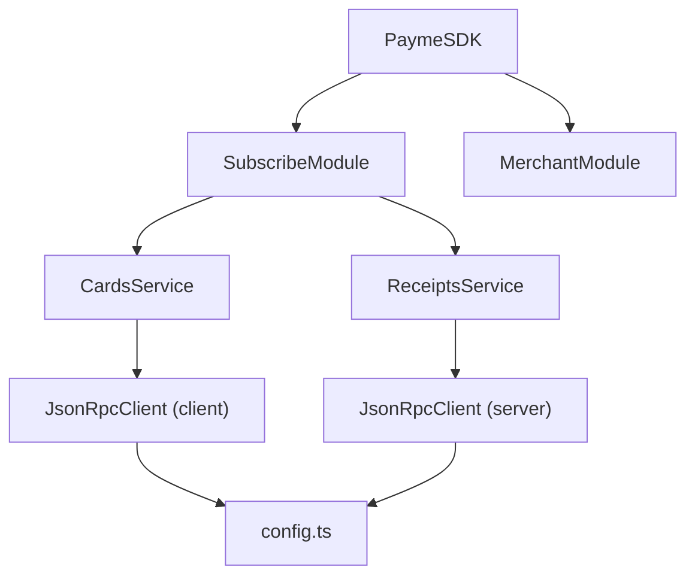

# ЦЕЛЬ
```typescript
const payme = new PaymeSDK({
  merchantId: "...",
  secretKey: "...",
  mode: "test",
});

await payme.subscribe.cards.create(...)
await payme.subscribe.cards.verify(...)

await payme.subscribe.receipts.create(...)
await payme.subscribe.receipts.pay(...) 
```


# Архитектура



PaymeSDK          — фасад, точка входа (Composition Root)
SubscribeModule   — группирует cards + receipts
CardsService      — методы cards.*
ReceiptsService   — методы receipts.*
JsonRpcClient     — транспорт (уже есть)
config.ts         — pure functions (оставить как есть)